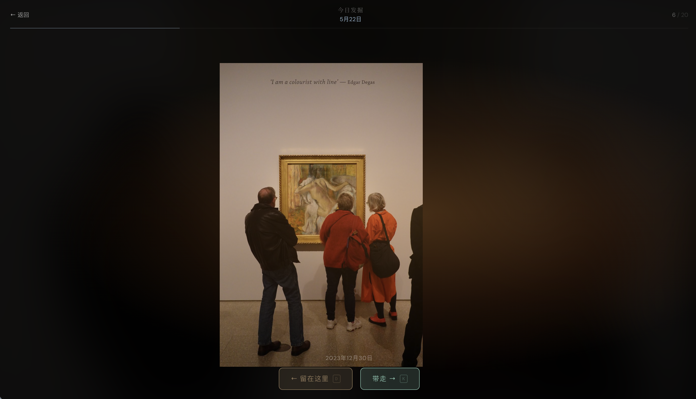
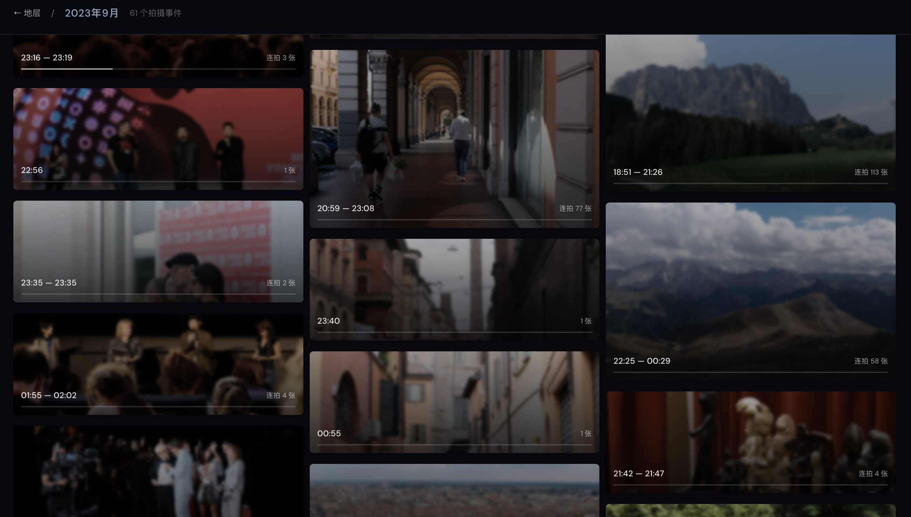
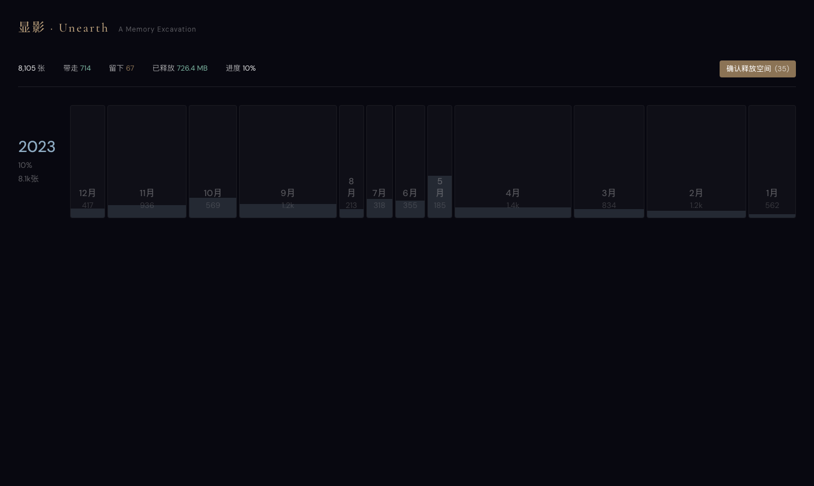
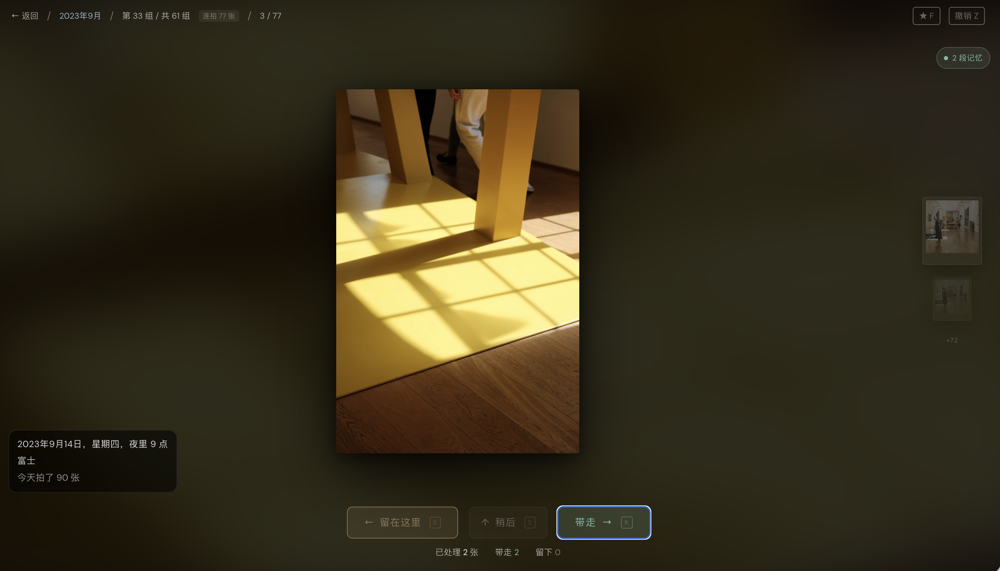

# 显影 · Unearth

**个人神话生成引擎 · A Personal Mythology Engine**

> 日常之物，冠上非常之感。  
> *Ordinary objects. Extraordinary weight.*

[](https://github.com/rickyke2023-ctrl/unearth)
[](https://github.com/rickyke2023-ctrl/unearth/releases)
[]()
[]()

---

## 这是什么

四年、三个国家、四万张照片、900GB。

大多数摄影师面对这种量级的积压，最终都放弃了。因为问题不在工具，而在于整理照片这件事本身让人感觉像做家务，而不是在重拾记忆。

**显影不是一个整理工具。它是一面文学镜头。**

一张 2021 年街头的纸杯，经过正确的叙事框架，可以是村上春树式的孤独物件，也可以是《山海经》里某种尚未命名的神物，也可以是《酒吧长谈》里那个时代留下的证物。叙事框架变了，意义就变了。你的照片没变，但你与它们的关系变了。

**这是显影和所有照片管理工具的根本区别：** 我们在做的不是帮你归档，而是帮你讲故事。

---

## 它长什么样


*今日发掘 — 一张埋在地质层下的照片，用鼠标划开土层来揭开它。*


*随着你的刮动，照片从黑暗中浮现。*



*完全显影。现在决定：带着它走，还是留在这里。*

---



*场地视图 — 你的月份作为一个发掘现场，照片自动聚类为拍摄事件。*



*地层视图 — 每一年是一个地质层，每个月是一个与照片数量成比例的色块。*



*决策视图 — 拍立得队列、记忆胶囊、快捷键流。*

---

## 叙事引擎

这是显影的核心技术层，也是产品的真正野心所在。

每张照片经由本地 VLM 分析后，获得一组**感知字段**——不是"图片里有人"这种分类标签，而是叙事原材料：

| 字段 | 说明 | 示例 |
|---|---|---|
| `narrative_hint` | 文学感官描述（30-40字） | "午后的光斜穿窗帘，落在一双手上——那种停顿，像是某个决定刚刚做完" |
| `emotion_tone` | 情绪色温 | `contemplative` / `melancholic` / `joyful` |
| `composition` | 构图特征 | `layered` / `negative_space` / `centered` |
| `time_of_day` | 光线时段 | `golden_hour` / `overcast_day` / `blue_hour` |
| `color_palette` | 主色调 | `warm_amber` / `cool_blue` / `desaturated` |

这些字段是**叙事聚类的原材料**。系统不是按日期排列照片，而是按叙事逻辑找到它们之间的联系。

### 当前已有的叙事模式（文学镜头）

每个模式是一个独立的叙事框架，决定照片如何被选取、排列和呈现：

**日常生活镜头**  
村上春树式的感官细节。今天你早上八点拍的那杯咖啡，和三年前同一天的另一杯。不是记录，是共鸣。

**《山海经》镜头**  
VLM 对图像的"误读"在这里被当作特性使用——模型把白狗看成鹿、把飞机窗外看成水面，这是它在对日常物件做神话化解读。我们拥抱这种失真，将其构建成私人的神话地理志。

**《酒吧长谈》时间回响**  
同一个小时时段跨越多年——你的 2019 年夜晚和 2024 年夜晚在时间轴两端相对。年份差越大，对话越戏剧化。这是一种记忆再巩固的体验，不是整理，是回声。

**《哈扎尔词典》— 叙事导航层**  
不再是独立模式，而是整个叙事引擎的入口界面。用户翻开词典，选择进入哪个叙事世界。词条即入口，词典即地图。

### 近期规划的叙事模式

**《看不见的城市》— 你一生都在拍什么**  
系统扫描全库，找出你反复出现的主体——窗、路口、夜晚餐厅、空椅子——将它们跨越年份聚合成"城市"。"原来你拍了 847 张窗的照片。"这个发现本身就是礼物。

**舞台背景模式**  
一张 2024 年冬天咖啡馆的照片，背景换成缓慢流动的水墨山水。照片是真实的、日常的；背景是神话的、非现实的。两者叠放，那杯咖啡就有了别的意味。由 VLM 标签（`dominant_colors`、`mood`）驱动背景的颜色和节奏，CSS/Canvas 实现，不依赖外部 AI。

**诗集模式**  
全屏一张照片，旁边文字区域实时流式输出 150 字散文诗，像打字机或墨水印刷一样逐字出现。整个相册跑完，是一本属于你的图文诗集。

### 平台化愿景

显影的终极形态是一个**可 fork 的叙事引擎 + 文学插件商店**。

每个"文学镜头"是一个可独立分发的插件，包含：VLM 感知配置（prompt 模板）+ UI 视觉语言 + 照片聚类逻辑 + 叙事参照框架。任何人可以 fork 并接入自己的文学框架——《百年孤独》魔幻现实主义镜头、日本物语系列、任何你觉得有意思的文化系统。我们只做引擎和接口。

---

## 隐私哲学

**显影的所有 AI 推理 100% 在本地运行，你的照片永远不会离开你的设备。**

市面上几乎所有的"AI 照片分析"工具都在做同一件事：把你的图片上传到云端，用大模型打标签，然后把结果返回给你。这意味着你的私人记忆——家人的脸、你曾去过的地方、你曾经历的时刻——成了别人模型的训练数据。

我们明确拒绝这种做法，原因不只是产品选择，而是**设计哲学**：

> 记忆是你的私有领土。任何工具都没有权利用它来喂养一个不属于你的系统。

显影做出以下承诺：

- **本地 VLM 推理** — 使用量化的开源模型（gemma4、qwen2.5vl）在你的 Mac 上运行，无需网络，无需 API key
- **本地 SQLite 数据库** — 刻意选择，不是技术债。所有分析结果、决策记录、叙事标签都在你的本地磁盘
- **软删除安全层** — 所有"放弃"的照片先进入 30 天缓冲区，配合 XMP sidecar 追踪和仅追加审计日志，确保任何文件操作都可溯源
- **零云依赖** — 没有账号、没有同步、没有分析数据上传

这也是为什么我们在后端数据库架构上花了大量时间做设计和选型——不是因为技术复杂度，而是因为**保护记忆安全本身就是产品的核心承诺**。

显影未来会开放对不同 AI 后端的接口（用户可以选择接入哪个模型），但本地优先、零强制上传的原则不会改变。

---

## 主要功能

**今日发掘 — 跨年同日**  
每天推送同一日历日期跨年的照片（你所有的5月21日，从2019到2025，并排摆在一起）。最出乎意料的功能：你会发现自己在不同年份的同一天，拍了同一种东西。

**地层视图 — 你的人生剖面**  
每一年是一个地质层，每个月是一个色块，宽度与照片数量成比例。完成的月份发光。你第一眼就能看出哪些年份是密集的，哪些年份有空缺。

**场地视图 — 自动聚类拍摄事件**  
照片按时间间距（< 30 分钟 = 同一事件）自动聚类。进入任意事件，开始决策。

**决策视图 — 发掘洞穴**  
全屏照片 + 环境虚化背景，拍立得队列在侧。键盘优先，撤销栈，流式体验。

**记忆画廊 — 你选择携带的**  
按年浏览所有已保留的照片。一个正在生长的收藏。

**诗集模式 — 你的图文诗集** *(beta)*  
全屏照片 + 旁边实时流式输出的文学描述，像打字机逐字出现。整个相册跑完是一本散文诗集。

**哈扎尔词典 — 叙事入口**  
词典形式的叙事模式导航：翻开词条，选择你今天想进入哪个叙事世界。

**键盘优先**

| 按键 | 动作 |
|---|---|
| `K` 或 `→` | 带着它走（保留）|
| `D` 或 `←` | 留在这里（软删除）|
| `S` 或 `↑` | 之后再决定（跳过）|
| `Z` | 撤销 |
| `F` | 标记为书候选 |
| `Space` | 全屏灯箱 |

---

## AI 推理层

**工程实现：**

- 本地运行 [gemma4:e4b-it-4bit](https://ollama.com/library/gemma3) GGUF 量化模型（通过 omlx 引擎加速）
- 完成四模型 benchmark（Gemma4、Qwen2.5VL-7B、LLaVA、MiniCPM）对比评测，详见 [`docs/BENCHMARK_COMPARISON.md`](docs/BENCHMARK_COMPARISON.md)
- 对 **1,993 张真实照片**完成生产级批量标注，成功率 99.95%
- 三层稳定性防护：checkpoint 断点续传 + quality gate + crash recovery
- `narrative_hint` 防公式化机制：同一场景 30 次调用不重复句式

**两层标注架构：**

```
第一层（全库批量）   qwen2.5vl:7b    结构化字段，consistency 优先
第二层（精选精标）   gemma4:e4b      文学质量优先，拥抱幻觉，叙事变形原材料
```

---

## 技术栈

| 层 | 技术 |
|---|---|
| 前端 | React 18 + Vite + TypeScript + Framer Motion + Zustand |
| 后端 | Python 3.11 + FastAPI + SQLite |
| AI 推理 | omlx + gemma4:e4b GGUF（本地，零云依赖）|
| RAW 解码 | rawpy（libraw）— Sony ARW、Fuji RAF |
| 音频 | Web Audio API — 程序化生成，零外部文件 |
| Canvas | HTML Canvas `destination-out` 合成（土层刮开效果）|
| 字体 | Cormorant Garamond（标题）+ DM Sans（正文）|
| 存储 | 本地 SQLite — 刻意选择：本地优先，零依赖，单用户 |
| 后端复杂度 | RAW 解码、EXIF 解析、事件聚类算法、软删除 + XMP sidecar 追踪 + 仅追加审计日志、异步预览管道、GPS 聚类 |

---

## 快速开始

**前置条件：** Node 18+，Python 3.11+，一个照片文件夹

```bash
git clone https://github.com/rickyke2023-ctrl/unearth.git
cd unearth

# 后端
cd backend
pip install -r requirements.txt
# 编辑 config.py，把 PHOTO_ROOT 指向你的照片文件夹
python main.py

# 前端（新开终端）
cd frontend
npm install
npm run dev
# 打开 localhost:5173
```

扫描 8,000 张约需 15 秒。支持 RAW（Sony ARW、Fuji RAF）、JPEG、HEIF、PNG。

> **注意：** 目前为单用户 Mac 本地工具，照片按 `year/month/` 组织（Lightroom 导出结构）。

---

## 开发方式

这个项目是一次 **Human-AI Co-development** 实验。

由我（产品与交互设计决策）和 AI 编码代理（Claude + Codex）协作构建：

- **我负责：** 产品方向、叙事框架设计、交互体验、技术架构决策、质量验收
- **AI 负责：** 代码实现、管道搭建、bug 修复、文档生成

核心工作时间约 **5 天**，完成了：前端五大视图、后端 API、RAW 解码管道、VLM 推理管道、1,993 张照片的批量 AI 标注与质量验收。

这不是"让 AI 帮我写代码"的工作流，而是把多个 AI agent 当作可调度的工程团队——我在做产品经理 + 首席设计师的角色，判断做什么、为什么做、做到什么程度。

开发过程日志：[`docs/`](docs/)

---

## 路线图

**v0.2 — 已完成**
- [x] 完整决策循环（保留 / 留下 / 跳过 / 撤销 / 标星）
- [x] 地层、场地、决策、发掘、记忆画廊五大视图
- [x] 软删除 + 30 天缓冲区 + 审计日志
- [x] 今日发掘 — 跨年同日推送
- [x] 程序化音频 + 8 层地质 Canvas 纹理

**v0.3 — 当前**
- [x] 本地 VLM 推理管道 + 四模型 benchmark
- [x] 1,993 张照片批量 AI 叙事标注
- [x] 叙事引擎 MVP（微光之门 + 诗集打字机 + 哈扎尔词典导航层）
- [ ] 摄像头手势：用手在摄像头前刮开土层（MediaPipe Hands — 接口已预留）
- [ ] EXIF schema 补全（焦距、光圈、ISO）
- [ ] 每天 20 张日常叙事流（算法选片，不是用户手动刷）

**v1.0 — 叙事引擎完整版**
- [ ] **日常生活模式** — 按 `narrative_hint` 情绪聚类，村上春树式感官呈现
- [ ] **《山海经》模式** — 幻觉驱动神话解读，私人地理志
- [ ] **《酒吧长谈》时间回响** — 同小时跨年对话，年份差加权
- [ ] **《看不见的城市》** — 你一生反复拍的主体，聚合成"城市"
- [ ] **舞台背景模式** — VLM 标签驱动的神话背景，与照片叠放
- [ ] 100 张 onboarding 流程（< 2 分钟进入叙事体验）

**v2.0 — 开放平台**
- [ ] 一键安装脚本（`curl | sh`，自动处理所有环境配置）
- [ ] 打包为独立 Mac 应用（Tauri，不需要命令行）
- [ ] **叙事引擎插件化** — 每个文学镜头成为可独立 fork 的插件（prompt 模板 + UI + 聚类逻辑）
- [ ] **插件商店** — 开放接口，接受社区贡献的文学框架
- [ ] 开源发布（MIT）

---

## 设计哲学

> 显影不是照片管理工具。  
> 它是一面镜子——你以为你在整理照片，  
> 它在帮你读懂，这些年你一直在看什么。

*Unearth is not a photo management tool.  
It's a mirror — you think you're organizing photos,  
it's helping you understand what you've been looking at all these years.*

---

*显影 · Unearth — v0.3.0 · 2026 · 所有推理本地运行*
